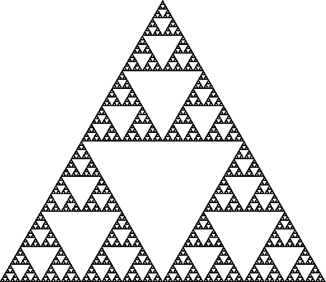
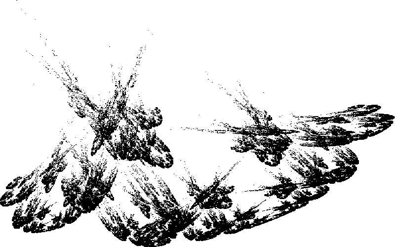
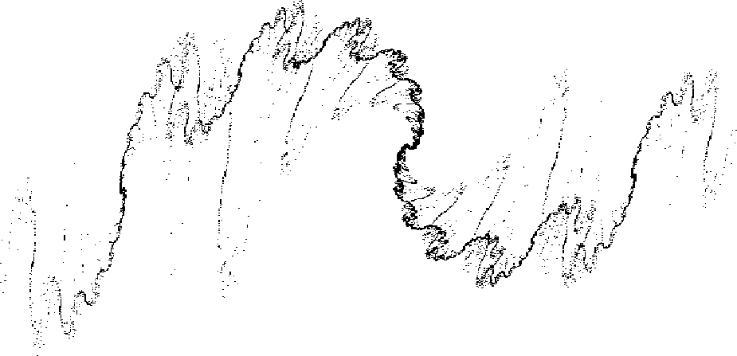
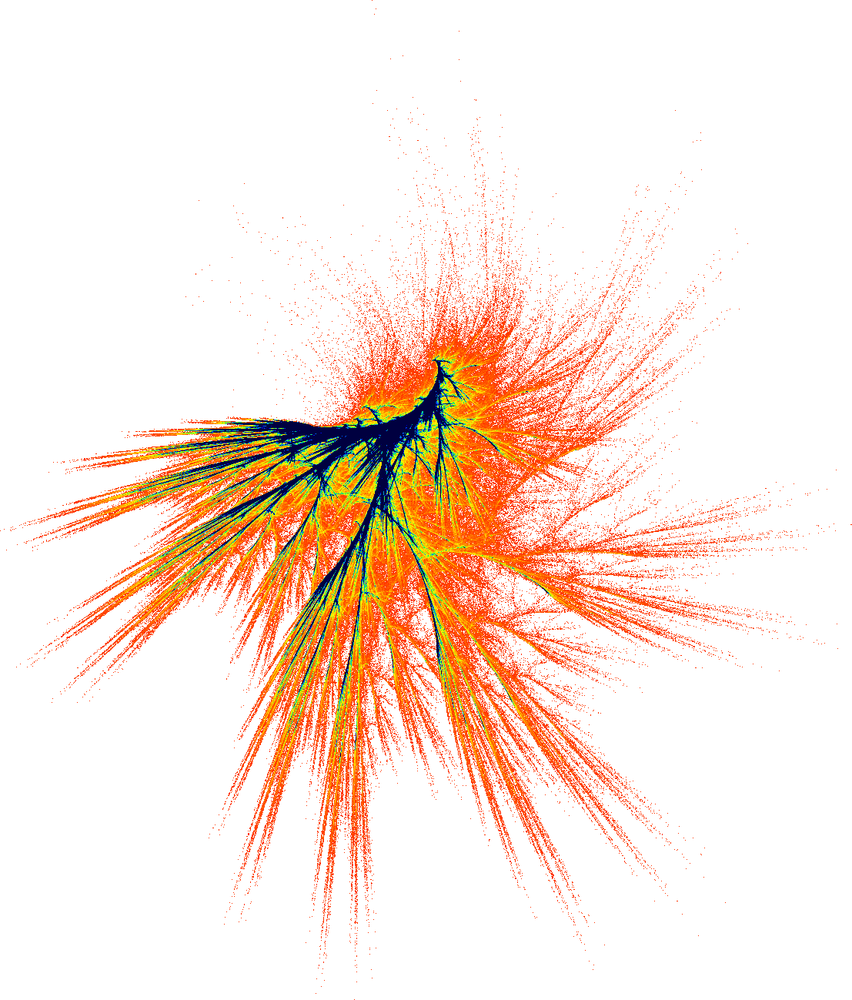

# IFSPlot

Plot fractals using the Iterated Function Systems in C++.
Fractals such as clouds or plants can be generated using the iteration of one or more affine transformations.

# Installation

```R
# install.packages("devtools")
devtools::install_github("cesandovalp/IFSPlot")
```

# Examples

## Barnsley Fern
### Code

```R
library(IFSPlot)

m1 = matrix(data = c(+0.00, +0.00, +0.00, +0.16), nrow = 2, ncol = 2)
m2 = matrix(data = c(+0.85, -0.04, +0.04, +0.85), nrow = 2, ncol = 2)
m3 = matrix(data = c(+0.20, +0.23, -0.26, +0.22), nrow = 2, ncol = 2)
m4 = matrix(data = c(-0.15, +0.26, +0.28, +0.24), nrow = 2, ncol = 2)

v1 = c(0.00, 0.00)
v2 = c(0.00, 1.60)
v3 = c(0.00, 1.60)
v4 = c(0.00, 0.44)

probability = c(1, 85, 7, 7)

transformations = list(m1, m2, m3, m4)
translations    = list(v1, v2, v3, v4)

iterations = 10**7

result = RunIFS(transformations, translations, probability, iterations, 600*1200)
```
### Output


### Code

```R
library(IFSPlot)

m1 = matrix(data = c(+0.00, +0.00, +0.00, +0.16), nrow = 2, ncol = 2)
m2 = matrix(data = c(+0.85, -0.04, +0.04, +0.85), nrow = 2, ncol = 2)
m3 = matrix(data = c(+0.20, +0.23, -0.26, +0.22), nrow = 2, ncol = 2)
m4 = matrix(data = c(-0.15, +0.26, +0.28, +0.24), nrow = 2, ncol = 2)

v1 = c(0.00, 0.00)
v2 = c(0.00, 1.60)
v3 = c(0.00, 1.60)
v4 = c(0.00, 0.44)

probability = c(1, 85, 7, 7)

transformations = list(m1, m2, m3, m4)
translations    = list(v1, v2, v3, v4)

iterations = 10**7

result = RunIFS(transformations, translations, probability, iterations, 600*1200, 1)
```
### Output


## Sierpinski triangle
### Code

```R
library(IFSPlot)

m1 = matrix(data = c(0.5, 0, 0, 0.5), nrow = 2, ncol = 2)
m2 = matrix(data = c(0.5, 0, 0, 0.5), nrow = 2, ncol = 2)
m3 = matrix(data = c(0.5, 0, 0, 0.5), nrow = 2, ncol = 2)

v1 = c(0.00, 0)
v2 = c(0.50, 0)
v3 = c(0.25, sqrt(3)/4)

probability = c(33, 33, 34)

transformations = list(m1, m2, m3)
translations    = list(v1, v2, v3)

iterations = 10**7

result = RunIFS(transformations, translations, probability, iterations, 600*600)

```
### Output



## Random IFS
### Code

```R
transformations = list()
translations    = list()
probability     = c()

n_rules = ceiling(runif(1, 2, 5))

for(i in 1:n_rules) {
  transformations[[i]] = matrix(data = c(runif(1, -1, 1), runif(1, -1, 1), runif(1, -1, 1), runif(1, -1, 1)), nrow = 2, ncol = 2)
  translations[[i]]    = c(runif(1, -10, 10), runif(1, -1, 1))
  if(i < n_rules && sum(probability) < 100)
    probability = c(probability, ceiling(runif(1, 1, 100 - sum(probability))))
  else
    probability = c(probability, 100 - sum(probability))
}

iterations = 10**7

result = IFSPlot::RunIFS(transformations, translations, probability, iterations, 600*600)

#> transformations
#[[1]]
#           [,1]       [,2]
#[1,] -0.4306939 -0.3824292
#[2,] -0.8861779  0.2206868
#
#[[2]]
#           [,1]       [,2]
#[1,] -0.4247236 0.02783971
#[2,] -0.8051508 0.73832768
#
#[[3]]
#           [,1]       [,2]
#[1,] -0.0180402 -0.3716764
#[2,] -0.8905424  0.8767196
#
#> translations
#[[1]]
#[1] 5.428667 0.207256
#
#[[2]]
#[1] -7.0755932  0.9554882
#
#[[3]]
#[1] -4.3006790  0.1036099
#
#> probability
#[1] 83 11  6

```

### Output



### Code

```R
#[[1]]
#           [,1]        [,2]
#[1,] -0.7678027 -0.04480167
#[2,]  0.4884063 -0.79417768
#
#[[2]]
#           [,1]       [,2]
#[1,] -0.3808980 0.07212426
#[2,] -0.4468545 0.95750017
#
#> translations
#[[1]]
#[1]  6.8574590 -0.2493633
#
#[[2]]
#[1] 0.7330911 0.2557175
#
#> probability
# [1] 98  2

```
 
### Output



### Code

```R
transformations = list()
translations    = list()
probability     = c()

n_rules = ceiling(runif(1, 2, 5))

for(i in 1:n_rules) {
  transformations[[i]] = matrix(data = c(runif(1, -1, 1), runif(1, -1, 1), runif(1, -1, 1), runif(1, -1, 1)), nrow = 2, ncol = 2)
  translations[[i]]    = c(runif(1, -10, 10), runif(1, -1, 1))
  if(i < n_rules && sum(probability) < 100)
    probability = c(probability, ceiling(runif(1, 1, 100 - sum(probability))))
  else
    probability = c(probability, 100 - sum(probability))
}

iterations = 10**7

result = IFSPlot::RunIFS(transformations, translations, probability, iterations, 600*600, 2)

#> transformations
#[[1]]
#            [,1]      [,2]
#[1,]  0.66640006 0.4746569
#[2,] -0.04795423 0.4930780
#
#[[2]]
#          [,1]       [,2]
#[1,] 0.5868358 -0.6407019
#[2,] 0.9718777  0.6517174
#
#[[3]]
#          [,1]       [,2]
#[1,] 0.3972159 -0.2148658
#[2,] 0.3573538  0.3081989
#
#> translations
#[[1]]
#[1] -8.993093 -2.422015
#
#[[2]]
#[1] -8.787602 -4.981803
#
#[[3]]
#[1] 1.562586 9.455961
#
#> probability
#[1] 63 21 16

```

### Output


